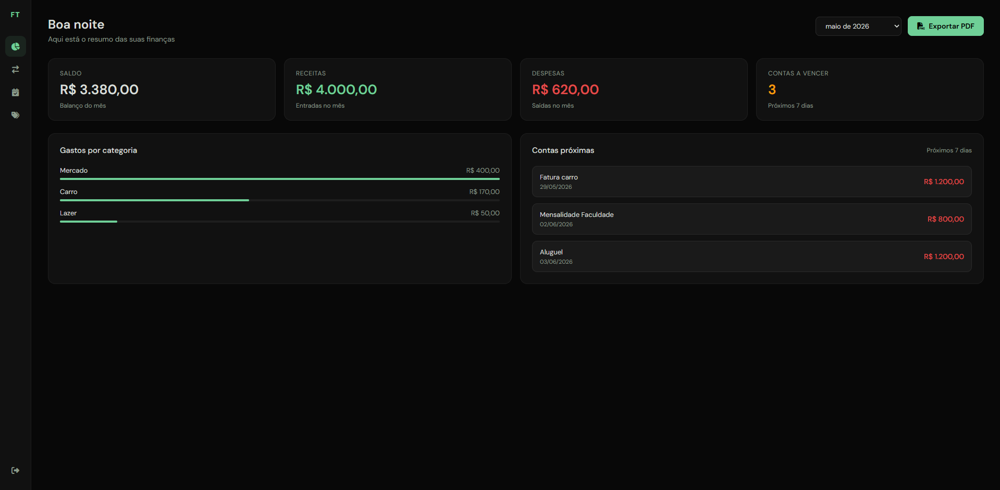
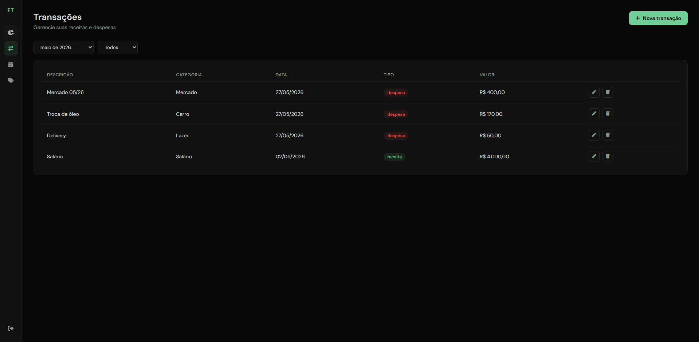
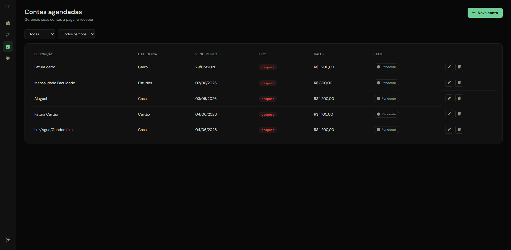
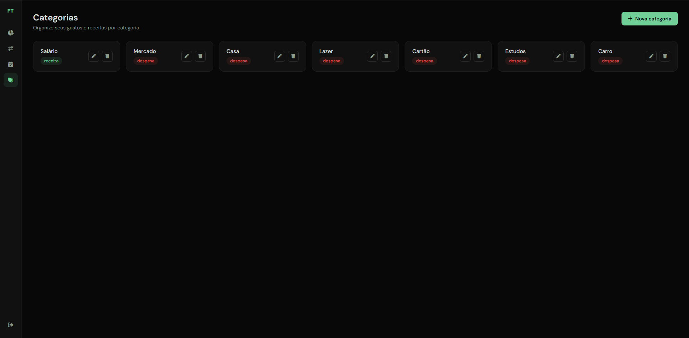
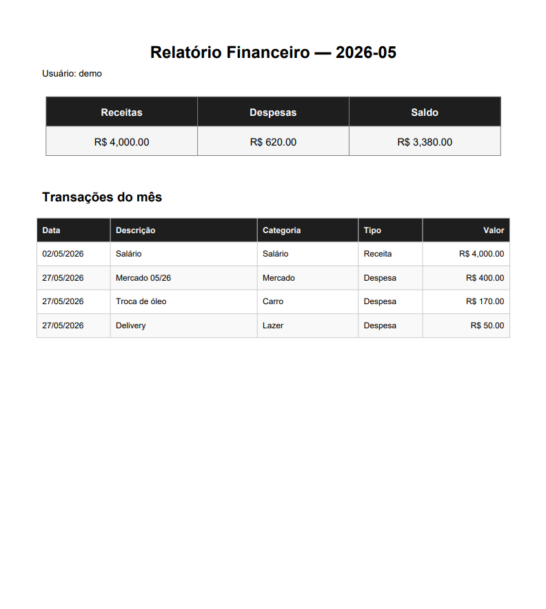

# FinTrack — Gestão Financeira Pessoal

Sistema web para controle de finanças pessoais. Permite registrar receitas e despesas, agendar contas a pagar e receber, visualizar relatórios mensais e exportar extratos em PDF.

**Demo**

| | URL |
|---|---|
| Frontend | `em breve` |
| API | `em breve` |
| API Docs | `em breve/api/docs/` |

**Acesso demo**

```
Usuário: demo
Senha: demofintrack123
```

---

## Screenshots

**Dashboard**



**Transacoes**



**Contas Agendadas**



**Categorias**



**Relatorio PDF**



---

## Tecnologias

**Backend**

- Python 3.13
- Django 6.0 + Django REST Framework
- PostgreSQL (Neon)
- JWT Authentication (SimpleJWT)
- Geração de PDF (ReportLab)
- Recorrência mensal automática (python-dateutil)
- Docker + Docker Compose

**Frontend**

- HTML, CSS e JavaScript puro
- Consumo da API REST via Fetch API
- Font Awesome (ícones)
- DM Sans (tipografia)

**Deploy**

- Backend: Render
- Frontend: Netlify

---

## Funcionalidades

- Autenticação com JWT — login e logout com blacklist de token
- Cadastro e gestão de transacoes com categorias personalizadas
- Contas agendadas a pagar e receber com alerta de vencimento
- Recorrencia mensal automatica — ao pagar uma conta recorrente, o sistema agenda automaticamente o mes seguinte
- Criacao automatica de transacao ao marcar conta como paga
- Dashboard com saldo, receitas, despesas e contas proximas
- Relatorio financeiro mensal com gastos por categoria
- Exportacao de relatorio em PDF
- Isolamento total de dados por usuario

---

## Testes

O projeto conta com testes automatizados cobrindo as camadas de Model e API.

O que e testado:

- Criacao e validacao dos models
- Todos os endpoints REST (GET, POST, PATCH, DELETE)
- Autenticacao — requisicoes sem token retornam 401
- Isolamento de dados — usuario só ve seus proprios registros
- Logica de pagamento — marcar conta como paga cria transacao automaticamente
- Idempotencia — marcar conta paga duas vezes nao duplica transação

Como rodar os testes:

```bash
python manage.py test app
```

Resultado esperado:

```
Ran 14 tests in X.XXXs
OK
```

---

## Estrutura do projeto

```
fintrack/
├── app/
│   ├── models.py          # Categoria, Transacao, ContaAgendada
│   ├── serializers.py
│   ├── views.py
│   ├── urls.py
│   └── tests.py
├── core/
│   ├── settings.py
│   └── urls.py
├── frontend/
│   ├── index.html
│   ├── dashboard.html
│   ├── transacoes.html
│   ├── contas.html
│   ├── categorias.html
│   ├── assets/
│   │   └── screenshots/
│   ├── css/
│   │   └── style.css
│   └── js/
│       ├── api.js
│       ├── auth.js
│       ├── dashboard.js
│       ├── transacoes.js
│       ├── contas.js
│       └── categorias.js
├── .env
├── .gitignore
├── Dockerfile
├── docker-compose.yml
└── requirements.txt
```

---

## Como rodar localmente

**Pre-requisitos**

- Docker e Docker Compose instalados

**1. Clone o repositorio**

```bash
git clone https://github.com/NicolasRenck/fintrack.git
cd fintrack
```

**2. Configure as variaveis de ambiente**

```bash
cp .env.example .env
```

Edite o `.env`:

```
SECRET_KEY=sua_secret_key
DEBUG=True
DATABASE_URL=postgres://postgres:postgres@db:5432/fintrack
ALLOWED_HOSTS=localhost,127.0.0.1
CORS_ALLOWED_ORIGINS=http://127.0.0.1:5500,http://localhost:5500
```

**3. Suba os containers**

```bash
docker compose up --build
```

**4. Rode as migracoes**

```bash
docker compose exec web python manage.py migrate
docker compose exec web python manage.py createsuperuser
```

**5. Inicie o frontend**

Abra a pasta `frontend/` com o Live Server do VSCode ou rode:

```bash
cd frontend
python -m http.server 5500
```

Acesse `http://127.0.0.1:5500/index.html`

---

## Endpoints principais

| Metodo | Endpoint | Descricao |
|---|---|---|
| POST | /api/token/ | Login |
| POST | /api/token/refresh/ | Renovar token |
| POST | /api/token/blacklist/ | Logout |
| GET/POST | /api/categorias/ | Listar e criar categorias |
| GET/PATCH/DELETE | /api/categorias/{id}/ | Detalhe, edicao e exclusao |
| GET/POST | /api/transacoes/ | Listar e criar transacoes |
| GET/PATCH/DELETE | /api/transacoes/{id}/ | Detalhe, edicao e exclusao |
| GET/POST | /api/contas/ | Listar e criar contas agendadas |
| GET/PATCH/DELETE | /api/contas/{id}/ | Detalhe, edicao e exclusao |
| GET | /api/resumo/ | Resumo financeiro do mes |
| GET | /api/relatorio/exportar/ | Exportar relatorio em PDF |
| GET | /api/docs/ | Documentacao Swagger |

---

## Variaveis de ambiente

| Variavel | Descricao |
|---|---|
| SECRET_KEY | Chave secreta do Django |
| DEBUG | True em desenvolvimento, False em producao |
| DATABASE_URL | URL de conexao com o banco PostgreSQL |
| ALLOWED_HOSTS | Hosts permitidos separados por virgula |
| CORS_ALLOWED_ORIGINS | Origens permitidas separadas por virgula |

---

## Autor

Nicolas Renck

- GitHub: [github.com/NicolasRenck](https://github.com/NicolasRenck)
- LinkedIn: [linkedin.com/in/nicolas-renck-75ba74232](https://linkedin.com/in/nicolas-renck-75ba74232)
- E-mail: nicolas.renck@gmail.com